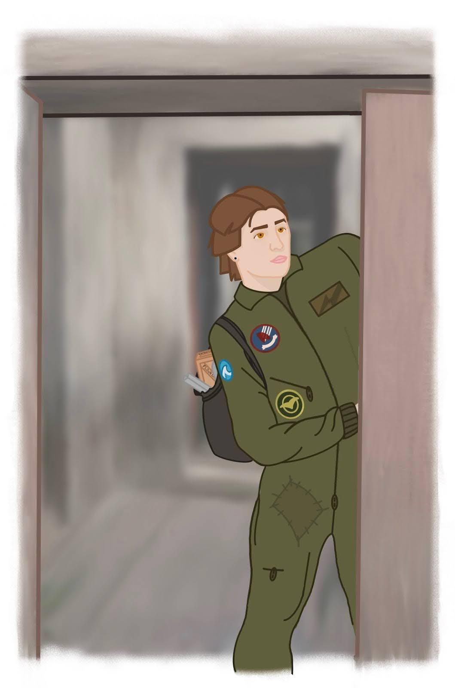

## Background

Cloudrunners are criminals. Although some may have noble intentions or lofty goals, the life of a cloudrunner is characterized by violent conflict, constant danger, and a struggle for survival. Most law-abiding citizens try to keep their head down and avoid cloudrunners at all costs, lest they become collateral damage in the fighting. Enterprising local businesses may enlist the help of cloudrunners for a variety of reasons - bodyguards/protection, disrupting corporate actions, smuggling money or goods, or any activities that they might want to keep hidden from the corporation. These contracts are the main source of income for most cloudrunners, highly prized and contested among rival cloudrunner “cells” (factions). Reputation is everything, and the “rules” of cloudrunner society are mostly self-enforcing. Nobody wants to hire someone who has sold out their contractor to the corporation, gone back on their promises, or repeatedly failed to complete their tasks, and so less reliable cloudrunners tend to be kicked out of groups and are left behind. Likewise, contractors rarely dare to deal in bad faith with cloudrunners because they know that they could just as easily be the cloudrunners’ next target.

## Description
**Cloudrunners** are criminals. Although some may have noble intentions or lofty goals, the life of a cloudrunner is characterized by violent conflict, constant danger, and a struggle for survival. Most law-abiding citizens try to keep their head down and avoid cloudrunners at all costs, lest they become collateral damage in the fighting. Enterprising local businesses may enlist the help of cloudrunners for a variety of reasons—bodyguards/protection, disrupting corporate actions, smuggling money or goods, or any activities that they might want to keep hidden from the corporation. These contracts are the main source of income for most cloudrunners, highly prized and contested among rival cloudrunner “cells” (factions). Reputation is everything, and the “rules” of cloudrunner society are mostly self-enforcing. Nobody wants to hire someone who has sold out their contractor to the corporation, gone back on their promises, or repeatedly failed to complete their tasks, and so less reliable cloudrunners tend to be kicked out of groups and are left behind. Likewise, contractors rarely dare to deal in bad faith with cloudrunners because they know that they could just as easily be the cloudrunners’ next target.

The reason cloudrunners are sought after (and how they got their name) beyond just hired muscle is their willingness to travel the skies. **“Cloudrunning”** refers to the act of strapping on a glider, jumping off a cliff or high building, and riding the winds to wherever they desire. Jump points for cloudrunning are closely guarded secrets, with each cell having preferred spots on each island. 

Using these gliders is incredibly dangerous, requiring intense concentration throughout the entire flight because one wrong move or slow reaction to a gust of wind means certain death. Because of this danger, the corporation does not attempt to control the skies, allowing cloudrunners free reign. However, the corporation is obviously aware of cloudrunner activities and will be monitoring the skies to the best of their (limited) abilities. For example, a corporate dreadnought will have at least one lookout and anti-air weapons (although the winds make conventional projectiles highly inaccurate). Cloudrunner missions are often characterized by stealth, planning, and subterfuge. Given the inherent danger of cloudrunner activities even without overt combat, pains are usually taken to avoid outright conflict: sneaking onto ships, avoiding guards, smuggling goods, and flying under the radar (literally). 

Cloudrunner is a job title more than anything, like calling someone a gangster. Etiquette and ground rules will vary from cell to cell, but generally, leaders expect dependability, respect, and effectiveness from members. Mistakes are tolerated but heavily punished, although most cloudrunner mistakes by themselves often result in a lengthy prison sentence or death. Cloudrunners live life on the edge, and as such, they live extremely fast. None of them expect to make it to old age, so every decision is fueled by adrenaline, dopamine, and a fight to see the next morning. 

Cloudrunners are made up of all species and genders, although birds tend to understand flying a bit better than everyone else. As long as they can keep up, anyone can be a Cloudrunner. People typically join cells either by being recruited (consensually or otherwise) or breaking the law and catching the attention of veterans. For some, being a Cloudrunner is a way to provide money for their family, even if they can’t be around them. For others, their cell is their family because they have nobody else. Some join to fight back against the corporation ideologically or settle a personal vendetta. Others are in it just for the thrill of the ride, although they usually tend to burn out quickly. Whatever their reasons, Cloudrunners are a wind-hardened bunch of criminals, stopping at nothing to achieve their goals.

## Skills and Customization

Cloudrunners need to be able to adapt and survive in a chaos-fueled environment on a daily basis. Because of their lifestyles, cloudrunners have become proficient in the following skills:

- **Mechanics**
- **Vehicles**
- **Thievery**
- **Sneakiness**
- **Force**

They also possess a unique skill exclusive to their culture:

- **Flying (Agility)** - Cloudrunners’ ability to fly using their equipment allows them to navigate through the airways, both for transportation and in conflict.

The typical cloudrunner is equipped with:

- **Wooden Weapons** (1d6+1 damage)
- **Cloudrunning Kite** for flight
- **Forging Kit** for creating false IDs and other critical documents

Cloudrunners also have the ability to communicate with cohorts who may not seem so friendly. Their adaptable nature enables them to interact with leaders of regional cells, corporation contacts, and other bosses from their previous work.
