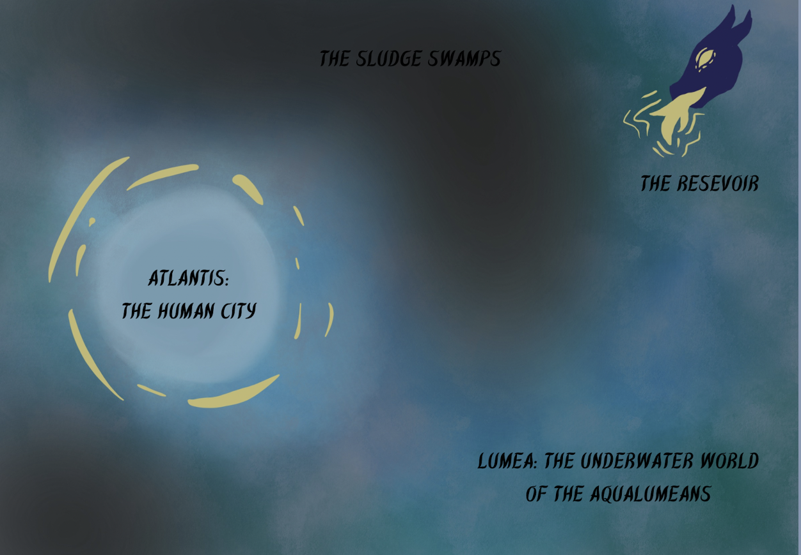
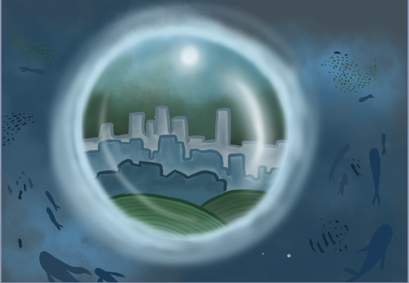

## Map 

## Introduction
It is far in the future. Earth’s surface has become virtually uninhabitable due to rampant pollution and extreme climate events. People who survive on land are exposed to extreme heat, violent storms, and many respiratory diseases that come from the polluted air they breathe. Survival is nearly impossible for the topsiders and they often die before reaching adulthood. 

Working to save humanity, top scientists from MegaCorp discovered an unexpected solution. The surface of the ocean hid an underwater utopia. There was only one problem— this underwater utopia wasn’t empty. 

The Aqualumeans, an intelligent underwater species, have lived beneath the surface for thousands of years in a region of the oceans they call Lumea. As the ocean’s natural energy became imbalanced, new magical forces seeped through to the surface, creating a bioelectric magic that the Aqualumeans call ‘Lux.’ Through Lux, they created a unique, sustainable environment that protected them from the violent world above. 

The scientists at MegaCorp found a way to source the bioelectric magic of the Aqualumeans and use it to create Atlantis: an underwater city designed to save humanity. Powered by the Aqualumean’s magic, the city and the surrounding waters are free from the pollution and sickness that plagues the surface. Encased in an air bubble that prevents the Aqualumeans from entering the city dubbed the Seaglass, the city feels almost like Earth— a new Earth. A place to start over. Forests and gardens grow, new children are born, and families are able to thrive. Since the birth of Atlantis, 50 years have passed and new generations have entered that don’t know the chaos and danger that made the city necessary. 

However, unbeknownst to the city’s general population, its creation and maintenance comes at a price. Megacorp has corrupted the Aqualumean’s magic and pushed it past its limits. While their magic created a barrier that protected Lumea against top-dweller pollution for thousands of years, it is starting to falter. Although the reason for this is not completely known or understood, the scientists of Atlantis suspect that the city’s use of Lux is contributing to this new problem. This in combination with a small but expanding magic pollution discharged from Atlantis is creating the Sludge Swamps— a muddy, poisonous area that is continuing to expand with the constant increase of human pollution. The Sludge Swamps have progressively been taking over one of the Aqualumean tribal villages, forcing many families and villagers to flee from the region as the pollution overtook the area. Within the Sludge Swamps are the Murk-Dwellers — Aqualumeans unable to escape or unfortunate enough to wander into the pollution’s proximity whose magic and bodies have been corrupted. They are angry, unreasonable beings that attack both humans and Aqualumeans alike. The Aqualumeans believe that saving Murk-Dwellers is possible only through taking them to the hidden reservoir of Aqualumean magic, where their corruption can be healed. However, this process is dangerous, as healthy Aqualumeans who enter the Sludge Swamps risk being infected themselves. Even if this daunting mission were to be completed, the human pollution from the Sludge Swamps leave the former Murk-Dwellers crippled with chronic health problems and a shortened life expectancy.

This problem leaves some Aqualumeans desperate to find a way to utilize the medical technology of Atlantis, as it is the only way to save the Murk-Dwellers– their former family members and friends– from the damage caused by the pollution. Meanwhile, the scientists at MegaCorp continue to search for the hidden Aqualumean reservoir, as finding a new source of Lux may be the only way to save the city and maintain their survival– even at the cost of the Aqualumeans’ lives.

Tensions are rising between the Aqualumeans and the human city of Atlantis and the Sludge Swamps are continuing to expand. What will be the fate of Lumea, and both of the races that have decided to call it home? Will the Aqualumeans take their home (and magic) back, and force the humans back to the inhabitable topside? Will the humans use their superior technology to take over all of Lumea, find the reservoir, and turn it into a new Earth? Will they be able to find a peaceful solution and save the Murk-Dwellers from pollution?  Will the Sludge Swamps expand to cover all of Lumea, leaving only the Murk-dwellers to survive? You will decide in our game :)

## Environements
There are 3 main environments in Lumea: [Atlantis](#atlantis), [The Sludge Swamps](#the-sludge-swamps), and the [Aqualumean Villages](#lumea-the-underwater-worlds).

### Atlantis
Atlantis was founded by a scientist division of MegaCorp, who established a one time lottery system to determine who would be invited to contribute to the birth of the city, advertising it as the beginning of a haven for the remaining humans of the topside away from the mutated species that had begun to form civilizations as pollution and society continued to develop. Invitations were extended solely to the humans and once the city was established, those that failed to qualify for habitation in Atlantis were left to succumb to the land’s ruin and thus began the last community of ‘pure’ humans alive. Nobody new is allowed into Atlantis– and nobody gets out, either– although, why would you want to leave such a harmoniously engineered society?

Atlantis is an artificially engineered underwater ecotopia city protected by a mystical air bubble where the surviving human race lives. This air bubble is known as the Seaglass, named for its ability to display the beauty of the ocean from a distance, though it is a traversable surface. The Seaglass is transparent for those inside the city, but when viewed from the outside, it mirrors the ocean and conceals Atlantis from view. This keeps the city hidden from potential threats while also supporting the founding scientist’s carefully crafted image that Atlantis exists in perfect harmony with the ocean around it  The Seaglass serves an additional purpose as an atmospheric regulator intended to simulate a mild, temperate climate all year round. It also acts as a daily illusion of the sky, amplifying the sunlight that filters through the ocean to follow the patterns of the sun, moon, and stars.

**A peak into Atlantis City from outside**

The Seaglass and the rest of the city is powered by an Aqualumean Lux core that sits in the heart of the city. Though it powers every system and structure, its impending depletion is a tightly guarded secret, and has only manifested in brief energy shortages in city power, which citizens are told to dismiss as caused by irrelevant attacks from external forces. Humans are able to live as they would on land but free of pollution and trouble inside Atlantis. They are able to explore outside the city, but they require full masks called ExoMasks that provide lightweight protection and access to oxygen.

Inside Atlantis, the city is organized into districts that are designed for a particular purpose and equipped with specific functions to support the city. The agricultural district is one of the principal districts, marked by its multi-tiered indoor farms and ability to produce a variety of crops and animals. Homes additionally have the ability to grow vegetables and fruits and are thus able to sustain themselves. The city’s water source is drawn from the ocean, desalinated, and recycled to maintain clean water use and provide irrigation for the farms. Grass has been exchanged for sand and native marine biodiversity has been engineered to survive in the open air within the Seaglass. The architectures mimic water flow with bioluminescence ingrained into the walls of most buildings so that they glow softly at night, which was designed to help citizens feel comfortable and safe. Courtyards were placed throughout the city to encourage communal gatherings and residential buildings were designed to emphasize open space with many windows and doors. These were built with sustainable materials to be responsive to the residents’ individual needs.

Transportation is efficient, silent, and eco friendly in Atlantis. The city primarily operates on a magnetic train system powered by the Lux core within its 2.5 mile diameter to connect further distances and E-cars have been established as an individual mode of transportation. The train and all other transportation has been engineered to maximize its efficiency while minimizing the core’s energy use. 

### Lumea: The Underwater Worlds
To the Aqualumeans, the entirety of the underwater realm is known as Lumea. However, in reality, their population only consists of a small portion of the vast oceans. The Aqualumeans live in 4 tribes tucked in vast kelp forests, within distance of each other. This has allowed Aqualumeans to build deep relationships with each other over time and share resources as well as defenses.

The Aqualumeans rely on Lux to nourish their people and land, which is a magic- and life-giving energy that is sourced from the Lux reservoir. The location of this reservoir is a secret guarded by the ruling chiefs of the tribes, who are known as the Celestial Dragons. The Aqualumeans do not alter their surroundings, instead choosing to draw from the ocean’s natural formations to shape their homes. Coral alcoves and anemone beds form the foundation of their architecture, providing shelter and unique lighting that varies with the ocean's natural cycles. Schools of vibrant fish and bioluminescent creatures swim freely through their living spaces.

However, because Lumea has been encroached upon by the humans, the region has been thrown into a disarray. The humans’ misuse of the Lux core has disrupted the flow of energy. As the Lux is disproportionately drained by supporting Atlantis, once-thriving regions are succumbing to the Sludge Swamps, a creeping area of dead and decaying marine life that spreads slowly but steadily into Aqualumean territory. The Aqualumean village closest to the pollution shed by the city and the land-living humans has become the center of the infected region. Those who were able to escape fled to the nearest villages while those infected remained in the Sludge Swamps, shells of their former communities and self.

### The Sludge Swamps
Like other areas of Earth, the pollution’s corruption of the sea has led to the creation of destructive sea mutants. Until recently, this phenomenon has not affected the Aqualumeans, but the pollution has now created the Sludge Swamps, an inhabitable part of Lumea that has been expanding due to the pollution of the human population. It is full of chemical pollution and waste, and has negative health consequences for anyone who enters it. One village had to evacuate to escape the oncoming Sludge Swamp. This region is full of pollution, black oil stains covering the Aqualumean architecture and coral reefs, which have now mutated to be larger in size, look necrotic, and have a foul smell. Murk Dwellers are the corrupted Aqualumean population that live in the Sludge Swamps – as a result of being exposed to pollution, they have become violent and angry. They survive by scavenging dead animals who have been affected by the pollution. The Murk Dwellers submit to the law of survival of the fittest – though they have no organized form of community they recognize the power of the Murk Dwellers stronger than them, meaning that the more stable areas of the Sludge Swamps belong to the strongest.

